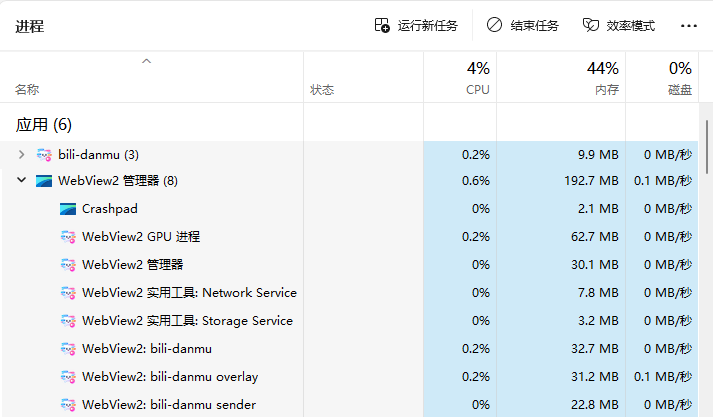
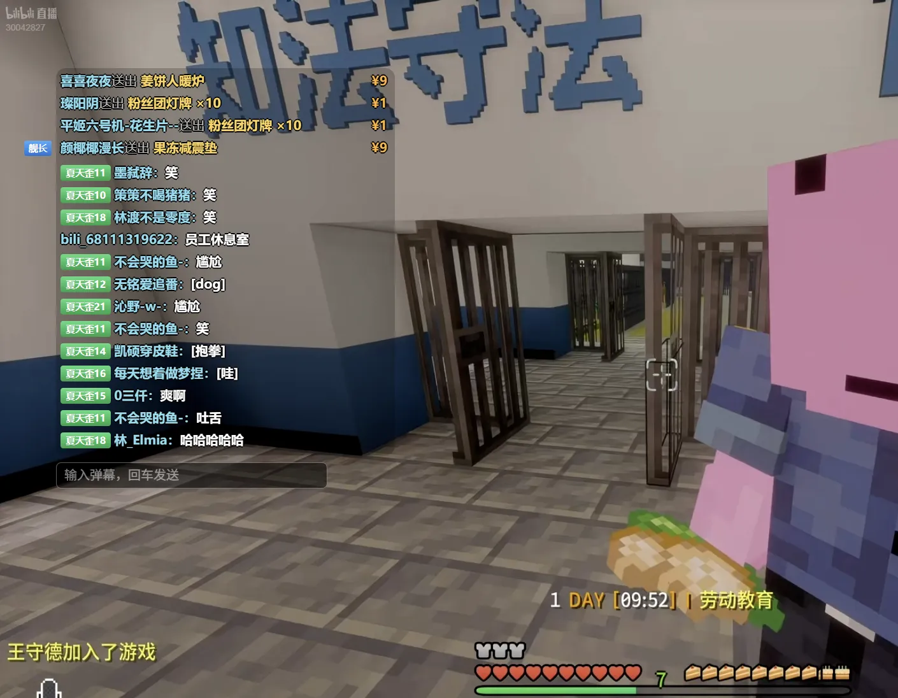
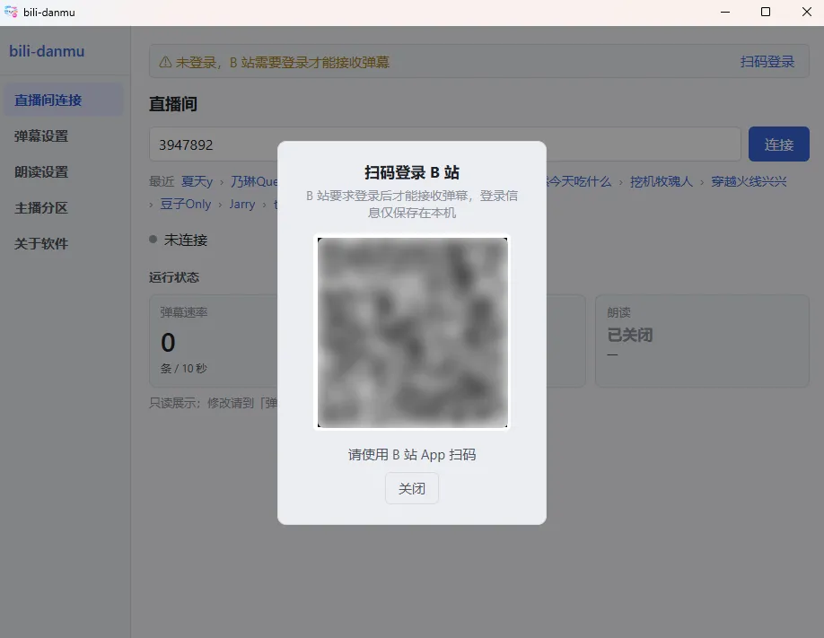
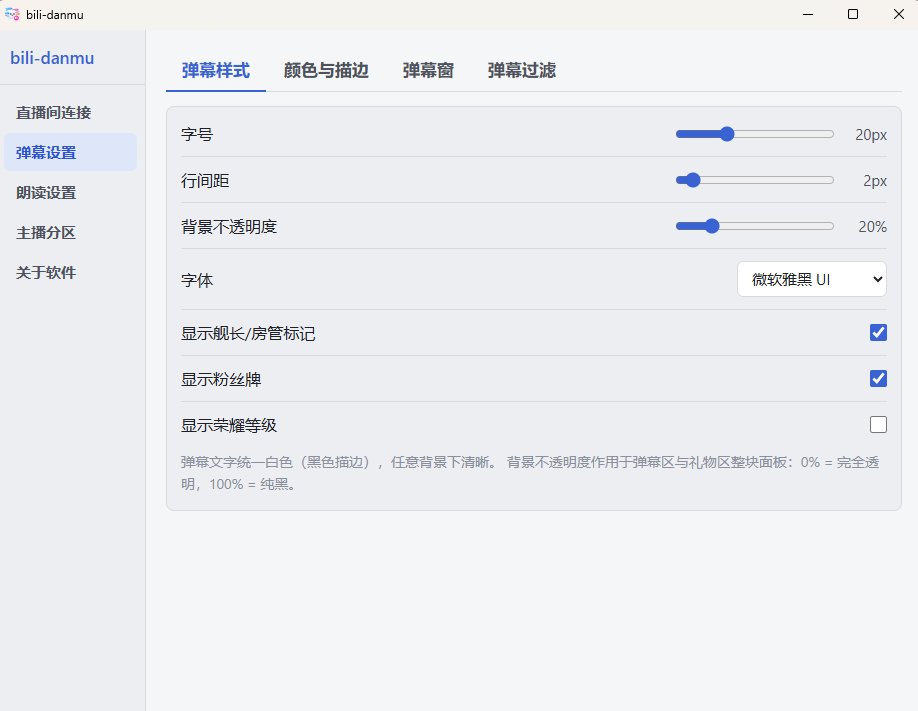
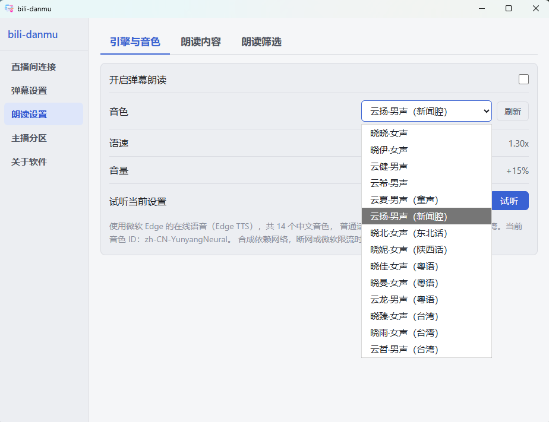
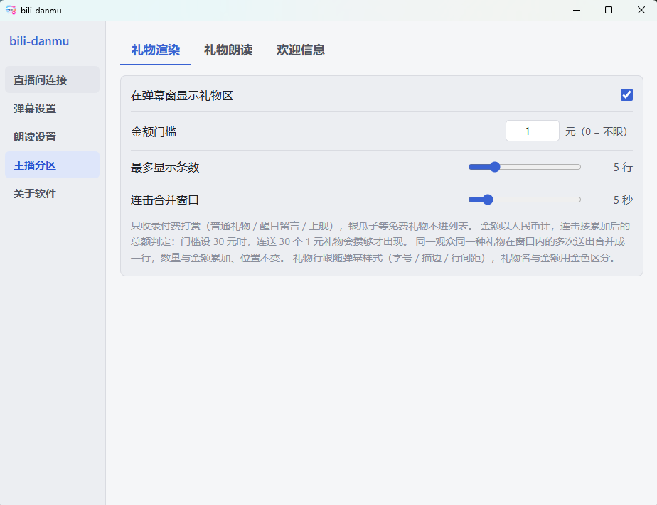
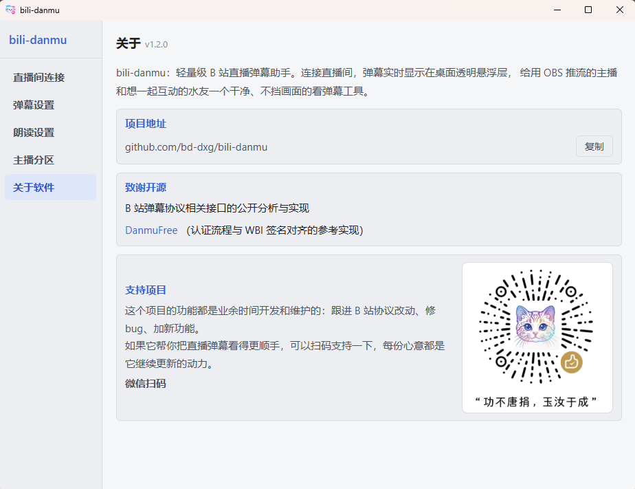

 douyin-danmu

抖音直播弹幕助手（Windows）：悬浮窗看弹幕 + Edge TTS 朗读，给用 OBS 推流的主播

> 🚧 **开发中**：本 README 的内容仍是 bili-danmu 的文案（项目由它复制改造而来，UI 与交互一致、协议层整个换成抖音）。
> 待重写的文档：本文件、`AGENTS.md`、`CONTEXT.md`、`docs/技术说明.md`。当前的实现细节以
> `probe/README.md`（协议实测结论）与代码注释为准。
>
> 来源与本项目的第三方依赖：
>
> - 骨架与设计来自 [bili-danmu](https://github.com/bddxg/bili-danmu)（GPL-3.0，同源派生）
> - 抖音协议蓝本：[SoraYjy/DanmuFree](https://github.com/SoraYjy/DanmuFree)（MIT）
> - 字段号对照：[saermart/DouyinLiveWebFetcher](https://github.com/saermart/DouyinLiveWebFetcher)（AGPL-3.0，仅本地对照，不进本仓库）
> - 签名 JS：webmssdk 的反混淆产物，版权归字节跳动；**不进本仓库**，用 `scripts/copy-sign-js.ps1` 或 `probe/README.md` 里的命令自行准备

## 开发背景

- 以前在用的弹幕助手早已停更，B 站弹幕协议更新后已无法正常接收弹幕。
- 现存的弹幕助手基于臃肿的桌面框架，体积大、资源占用高，不够轻量。
- 因此重写本项目：给用 OBS 推流的主播一个不挡游戏画面的看弹幕窗口，也给想和主播一起玩、一起互动的水友一个干净的看弹幕工具。
- 感谢开源社区：弹幕协议相关接口的公开分析与实现，以及 [DanmuFree](https://github.com/SoraYjy/DanmuFree) 的开源参考。

## 亮点

- **小**：安装包 2.9 MB，装完占硬盘 12 MB。不用额外装浏览器组件（Windows 自带）、不用装 Python、不用下载语音模型，双击下一步就能用。
- **不跟游戏抢电脑**：直播时游戏已经满负荷，助手不该再压上一块石头。内存占用很小，长时间挂着也不会越来越多；鼠标穿透一开，弹幕窗不拦鼠标，点击直接落到游戏上。
- **故意没做的功能**：没有用户头像、没有礼物图标，一行弹幕就是一行字；没有花哨动画，弹幕淡入进场不影响画面拖动；不打赏刷屏，同一个人送同一件礼物合并成一行显示总数量。
- **挂着就行**：断线自动重连，重连期间不弹报错、不刷屏；弹幕最多留 120 条，超出挤掉最早的，看一整天也不会卡。

挂着直播时，任务管理器里的占用

## 效果

弹幕窗透明，直接叠在游戏画面上；礼物行金色区分、连击只占一行；下方是发送框，回车发送

## 界面

  
  

左：扫码登录（登录信息只存本机）　右：字号、行距、字体、背景不透明度

  
  

左：朗读音色、语速、音量，可试听　右：礼物金额门槛、连击合并、礼物朗读

关于页：版本号、项目地址、致谢开源与赞赏码

## 快速开始

> 只想用不想编译：到 [Releases](https://github.com/bd-dxg/bili-danmu/releases/latest) 下载安装包（`bili-danmu_x.y.z_x64-setup.exe`）双击安装即可。

1. 扫码登录（**必做**：B 站 2025+ 不向游客推送弹幕，未登录收不到弹幕；登录后还会显示昵称）
2. 输入直播间号，点「连接」（也可点输入框下方的面包屑直连最近房间）
3. 弹幕实时显示在桌面透明悬浮窗；设置页可开鼠标穿透，让鼠标点击落到弹幕窗下方的窗口
4. 在弹幕窗下方的发送框输入文字，回车发送
5. 想听弹幕：到朗读页开启开关、选音色，点「试听」调好语速音量再挂后台

## 能做什么

| 功能 | 说明 |
|---|---|
| 收弹幕 | 连上直播间就实时收，断线自动重连，掉线不用手动管 |
| 弹幕窗 | 桌面透明悬浮窗，可拖动、可缩放、可置顶、可鼠标穿透，背景不透明度可调，位置和大小自动记住 |
| 只看想看的 | 只显示舰长 / 房管、只显示带粉丝牌的、荣耀等级门槛、敏感词屏蔽 |
| 发弹幕 | 弹幕窗下方独立发送框，回车发送，字号跟着弹幕走 |
| 朗读 | 14 个中文音色（普通话 / 方言 / 粤语 / 台湾），语速音量可调；念之前会清洗 emoji 和链接 |
| 礼物 / 醒目留言 / 上舰 | 显示在弹幕上方独立区域，可设金额门槛，连击只占一行显示总数量；也能念出来 |
| 其他 | 最近房间一键直连、系统托盘常驻、运行状态一览 |

还没做：滚动弹幕、顶弹、用户屏蔽、Windows 系统 TTS、开机自启、全局快捷键、自动更新。

## 数据与隐私

- 配置存在 `%APPDATA%\com.bilidanmu.app\config.json`；登录信息加密保存（和本机、本机用户绑定），配置文件拷到别的电脑也读不出来，要重新扫码
- 不收集任何信息、不上传日志
- 唯一的对外请求：开启朗读后，弹幕文字会发往微软 Edge TTS 服务合成语音，关掉开关就停

## 致谢与 License

本项目以 [GNU GPL v3](LICENSE) 开源。

实现参考了 [DanmuFree](https://github.com/SoraYjy/DanmuFree)（MIT License © SoraYjy），其协议与 WBI 签名实现源自该项目，特此声明致谢。

> 技术实现（功能状态、协议细节、架构、构建与发布）见 [docs/技术说明.md](docs/技术说明.md)。
